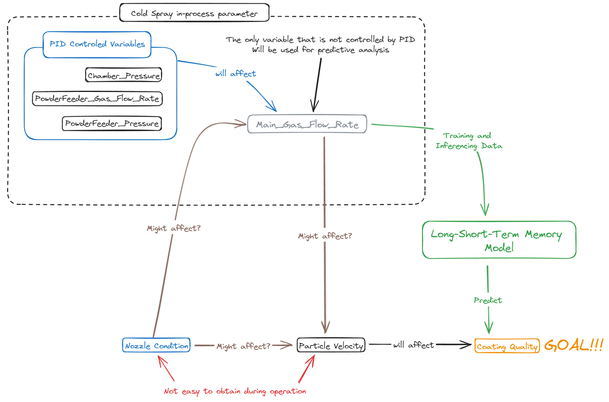
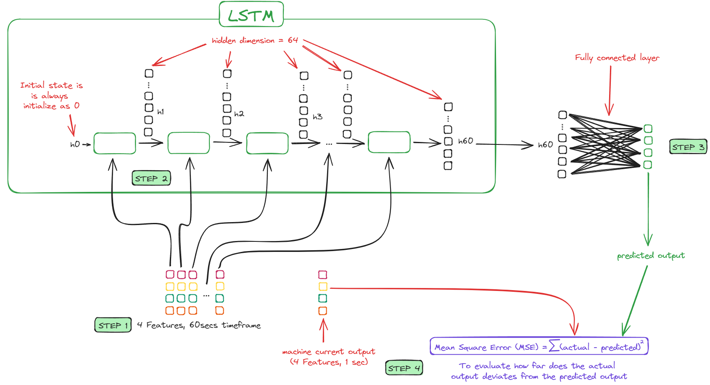
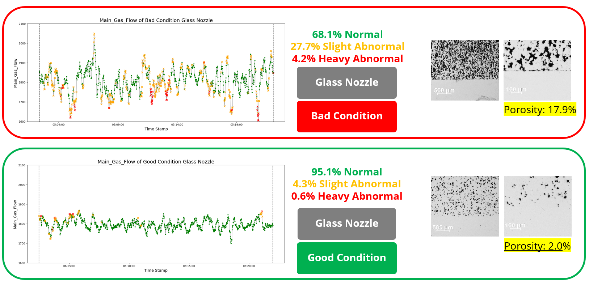
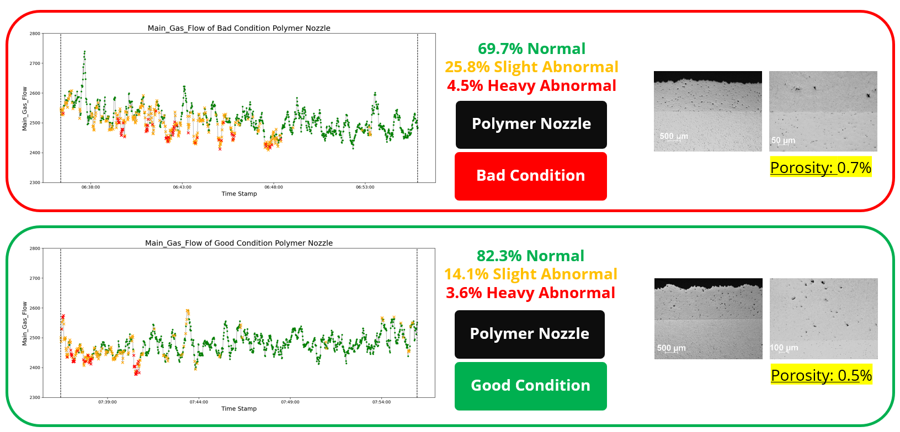

# Predictive Process Analysis and Outcome with LSTM Networks
📌 by @yongzane00
 
## Introduction
Manufacturing processes generate highly complex and interdependent time-series data, where process variables continuously evolve and influence one another. Analyzing these sequential dependencies is crucial for predicting process health and quality in real time. Long Short-Term Memory (LSTM) networks, a type of recurrent neural network, are well-suited for modeling such time-dependent relationships, making them effective for process analysis, anomaly detection, and predictive maintenance in advanced manufacturing.

However, before applying LSTM, it is critical to identify the most influential process variables that impact quality and performance. In our case, we focus on cold spray, a highly dynamic process where particle velocity is the key determinant of coating quality but is challenging to measure directly in real time. Through analysis, we identified that nozzle degradation, caused by abrasive wear from supersonic gas flow, alters spraying dynamics and affects particle velocity. Additionally, nozzle wear influences the main gas flow rate, which strongly correlates with particle velocity fluctuations. Given this dependency, we use Main Gas Flow Rate as a proxy indicator for predicting both particle velocity trends and coating quality.

By leveraging LSTM to capture these sequential patterns, we develop a data-driven predictive framework that enables real-time quality assessment, process monitoring, and predictive outcome. This approach minimizes reliance on offline inspections, reduces machine downtime, and enhances overall manufacturing efficiency while offering scalability to other time-series-driven industrial processes. 



## Methodology
To develop a predictive process analysis model, we first established a data communication protocol via OPC UA to enable real-time data extraction from the manufacturing system. For our experiment, we used two types of nozzles—glass and polymer, each tested in both good and degraded conditions, resulting in a total of four nozzle configurations for data collection.

The LSTM model was trained exclusively on good-condition nozzle data, using four key features extracted over a 60-second timeframe to capture temporal dependencies in the process. The model was designed with 64 hidden dimensions and incorporated a dropout layer to prevent overfitting. During inference, the fine-tuned LSTM was used to predict the next output in the sequence, reconstructing the expected process behavior. The mean absolute error (MAE) was employed as the evaluation metric, comparing the predicted values with the actual recorded output. Deviations in MAE serve as anomaly indicators, allowing for real-time process analysis and predictive quality assessment without direct particle velocity measurements. This approach enhances process monitoring, reduces downtime, and improves manufacturing efficiency.



## Results
To evaluate the effectiveness of our LSTM model, we tested it on a separate dataset collected from the same nozzle but at a different time than the training data. This ensures that the model is not memorizing patterns from the training data, eliminating overfitting concerns and providing a more realistic performance assessment.

Our results show that the LSTM model successfully predicts and reconstructs the expected behavior of a good-condition nozzle, yielding a lower percentage of anomaly data points. In contrast, the model fails to accurately predict the bad-condition nozzle, resulting in a higher Mean Absolute Error (MAE) and a significantly higher percentage of anomaly data points. This confirms that nozzle degradation directly impacts the predictability of the process, making LSTM a strong candidate for monitoring nozzle health.

Further analysis of glass nozzle data reveals that the percentage of porosity in the coating strongly correlates with the percentage of anomaly data points, reinforcing our confidence in the model’s predictions. However, for polymer nozzles, while the LSTM correctly differentiates between good and bad conditions based on anomaly percentage, the porosity of the coating does not show significant variation. This suggests that factors other than porosity may be influencing coating quality, warranting further investigation.

Overall, our findings demonstrate that LSTM effectively detects nozzle degradation based on time-series data, making it a valuable tool for predictive maintenance in cold spray and other industrial processes. While coating quality prediction may require additional factors, we strongly advocate for the application of LSTM networks in analyzing time-series data across various manufacturing systems for enhanced process monitoring and anomaly detection. 




## Quick Start
In this repository, we have developed a machine learning pipeline for:

- Training and evaluation on in-process data `LSTM_Process_Outcome_Prediction/code/`
- Real-time inference for deployment `LSTM_Process_Outcome_Prediction/cold_spray_opcua/`


### Dependencies
- 🐍 Python >=3.9 (PyTorch requires Python 3.9 or later)  
- 🔥 [PyTorch](https://pytorch.org/get-started/locally/#windows-prerequisites-2)

Here's the **improved and structured Markdown** with **support for virtual environments, Conda environments**, and **OPC UA connectivity**:  


### **Python Environment Setup**
To ensure a **consistent and isolated environment**, use either a **virtual environment** or a **Conda environment** before running the scripts.

---

## **Setting Up the Python Environment**
### **Using a Virtual Environment (venv)**
For users who prefer `venv` for environment management:  

1️. **Create a virtual environment**  
   ```bash
   py -m venv .venv
   ```

2️. **Activate the virtual environment**  
   - On **Windows**:  
     ```bash
     .venv\Scripts\activate
     ```
   - On **Mac/Linux**:  
     ```bash
     source .venv/bin/activate
     ```

3️. **Install required libraries**  
   ```bash
   pip install -r requirements.txt
   ```

---

### **Using Conda Environment**
For users who prefer **Conda** for environment management:

1️. **Create a Conda environment**  
   ```bash
   conda create -n coldspray python=3.9
   ```

2️. **Activate the Conda environment**  
   ```bash
   conda activate coldspray
   ```

3️. **Install required libraries**  
   ```bash
   conda env create -f environment.yml
   ```

---

## **Setting Up OPC UA Connection (For Data Extraction)**
If you are using **OPC UA** to connect to your machine for real-time data extraction, follow these steps:

1️. **Install OPC UA client**  
   ```bash
   pip install opcua-client
   ```

2️. **Run the OPC UA client GUI**  
   ```bash
   opcua-client
   ```

3️. **Verify Connection**
   - Ensure your **OPC UA server is running**.
   - Test the connection using the **OPC UA client** before running scripts.

